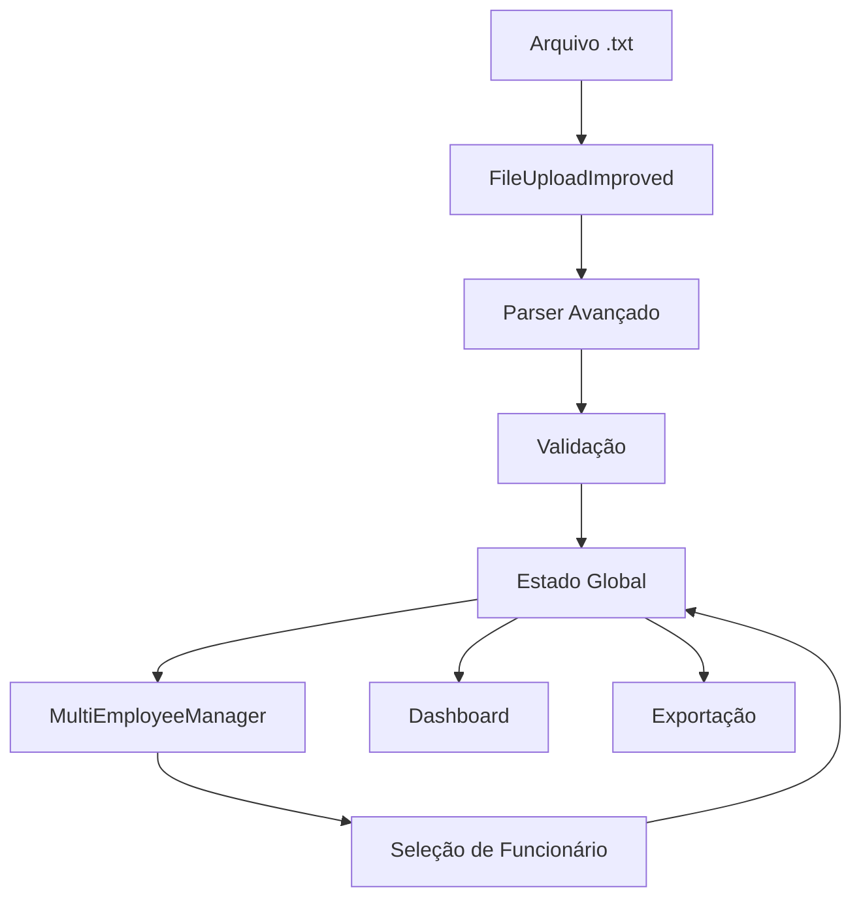

# Folha Transparente Web

Sistema web moderno para processamento e visualização transparente de folhas de pagamento.

## 🚀 Características Principais

### 📊 **Processamento Avançado**
- ✅ **Múltiplos funcionários** em um único arquivo
- ✅ **Parser inteligente** com fallbacks automáticos
- ✅ **Extração completa** de eventos financeiros
- ✅ **Validação robusta** com tratamento de erros

### 🎯 **Interface Moderna**
- ✅ **Design responsivo** com Tailwind CSS + shadcn/ui
- ✅ **Dashboard interativo** com múltiplas visualizações
- ✅ **Gerenciamento de funcionários** com seleção dinâmica
- ✅ **Upload drag-and-drop** com preview instantâneo

### 📈 **Funcionalidades de Transparência**
- ✅ **Visualização clara** de proventos e descontos
- ✅ **Resumos financeiros** por funcionário e geral
- ✅ **Exportação** em JSON e CSV
- ✅ **Dados estruturados** para APIs públicas

## 🛠️ Tecnologias Utilizadas

- **Frontend**: React 18 + TypeScript
- **Build**: Vite
- **UI**: shadcn/ui + Tailwind CSS
- **Roteamento**: React Router
- **Estado**: React Query
- **Ícones**: Lucide React
- **Gráficos**: Recharts

## 📁 Estrutura do Projeto

```
src/
├── components/
│   ├── ui/                    # Componentes base shadcn/ui
│   ├── FileUpload.tsx         # Upload básico (original)
│   ├── FileUploadImproved.tsx # Upload avançado (novo)
│   ├── MultiEmployeeManager.tsx # Gerenciador de funcionários (novo)
│   ├── DynamicPayrollHeader.tsx
│   ├── DynamicEmployeeCard.tsx
│   ├── DynamicFinancialSummary.tsx
│   ├── PayrollTable.tsx
│   ├── ProvisionTable.tsx
│   └── EditForms.tsx
├── pages/
│   ├── Index.tsx              # Página principal (atualizada)
│   └── NotFound.tsx
├── hooks/
├── lib/
└── main.tsx
```

## 🚀 Como Executar

### Pré-requisitos
- Node.js 18+
- npm ou yarn

### Instalação
```bash
# Clonar repositório
git clone <seu-repositorio>
cd folha-transparente-web

# Instalar dependências
npm install

# Executar em desenvolvimento
npm run dev

# Build para produção
npm run build
```

## 📋 Como Usar

### 1. **Upload de Arquivo**
- Vá para a aba "Upload"
- Use o **Upload Avançado** para melhor compatibilidade
- Arraste ou selecione um arquivo `.txt` de folha de pagamento
- O sistema processará automaticamente e detectará funcionários

### 2. **Visualização de Dados**
- **Dashboard**: Visão geral do funcionário selecionado
- **Funcionários**: Lista completa com seleção dinâmica
- **Editar**: Formulários para ajustes manuais

### 3. **Exportação**
- **JSON**: Dados estruturados para APIs
- **CSV**: Planilha compatível com Excel

## 🔧 Novos Componentes

### **FileUploadImproved.tsx**
```typescript
// Funcionalidades avançadas:
- Processamento de múltiplos funcionários
- Regex flexível para diferentes formatos
- Tratamento de erros detalhado
- Preview dos dados processados
- Validação de tipos de arquivo
```

### **MultiEmployeeManager.tsx**
```typescript
// Gerenciamento completo:
- Resumo geral da folha
- Seleção de funcionários
- Visualização individual
- Cards interativos
- Totalizadores automáticos
```

### **Index.tsx Atualizado**
```typescript
// Integração completa:
- Estado para múltiplos funcionários
- Exportação JSON/CSV
- Navegação entre funcionários
- Badges de status
- Compatibilidade com componentes existentes
```

## 📊 Formato de Dados Suportado

### Entrada (arquivo .txt)
```
NOVA TERRA DE SANTA CRUZ LTDA                   Folha de Pagamento Consolidada
51.838.101/0001-77
Competência: 01/06/2025 a 30/06/2025

1    LISA KEIKO YAMASHITA AOKI              Admissão: 08/09/2023
     Sexo: F      Função: GERENTE ADMINISTRATIVO
     Salário: 7.875,00

0010 Salário Base           220,00    0,00    7.875,00+
5500 IR Retido               0,00    10.073,38    1.861,45-
Tot.Pagamentos: 11.025,00    Tot.Descontos: 2.813,07    Líquido: 8.211,93
```

### Saída (JSON estruturado)
```json
{
  "empresa": {
    "nome": "NOVA TERRA DE SANTA CRUZ LTDA",
    "cnpj": "51.838.101/0001-77",
    "competencia": "01/06/2025 a 30/06/2025"
  },
  "funcionarios": [
    {
      "codigo": "1",
      "nome": "LISA KEIKO YAMASHITA AOKI",
      "funcao": "GERENTE ADMINISTRATIVO",
      "resumoFinanceiro": {
        "totalPagamentos": 11025.00,
        "totalDescontos": 2813.07,
        "liquido": 8211.93
      },
      "proventos": [...],
      "descontos": [...]
    }
  ],
  "resumo": {
    "totalFuncionarios": 1,
    "folhaBruta": 11025.00,
    "folhaLiquida": 8211.93
  }
}
```

## 🎨 Melhorias de UI/UX

### **Upload Avançado**
- ✅ Área drag-and-drop responsiva
- ✅ Indicadores de progresso
- ✅ Mensagens de erro claras
- ✅ Preview dos dados processados
- ✅ Estatísticas instantâneas

### **Gerenciador de Funcionários**
- ✅ Cards interativos
- ✅ Seleção visual clara
- ✅ Resumos financeiros
- ✅ Totalizadores dinâmicos
- ✅ Layout responsivo

### **Dashboard Aprimorado**
- ✅ Badges de status
- ✅ Botões de exportação
- ✅ Navegação intuitiva
- ✅ Feedback visual

## 🔄 Fluxo de Dados



## 🧪 Teste da Aplicação

### **Arquivo de Teste**
Use o arquivo `05 - NOVA TERRA - FOLHA DE PAGAMENTO CONSOLIDADA - 06 2025.txt` fornecido para testar:

1. Execute `npm run dev`
2. Acesse `http://localhost:5173`
3. Vá para a aba "Upload"
4. Use o "Upload Avançado"
5. Faça upload do arquivo de teste
6. Navegue pelas abas para ver os dados processados

### **Recursos para Debug**
- Console do navegador mostra logs detalhados
- Mensagens de erro específicas
- Preview dos dados antes de carregar

## 📈 Próximos Passos

### **Integrações Planejadas**
- [ ] **API REST** para backend
- [ ] **Banco de dados** para persistência
- [ ] **Autenticação** de usuários
- [ ] **Dashboard público** de transparência

### **Melhorias Futuras**
- [ ] **Gráficos avançados** com D3.js
- [ ] **Relatórios em PDF**
- [ ] **Comparação temporal**
- [ ] **API pública** para transparência

### **Formatos Adicionais**
- [ ] **Suporte a Excel** (.xlsx)
- [ ] **Import de CSV**
- [ ] **Conectores de sistemas** (SAP, Oracle)

## 🤝 Contribuição

### **Como Contribuir**
1. Fork o repositório
2. Crie uma branch: `git checkout -b feature/nova-funcionalidade`
3. Commit: `git commit -am 'Add nova funcionalidade'`
4. Push: `git push origin feature/nova-funcionalidade`
5. Abra um Pull Request

### **Padrões de Código**
- TypeScript para type safety
- ESLint + Prettier para formatação
- Componentes funcionais com hooks
- shadcn/ui para consistência visual

## 📄 Licença

Este projeto está sob a licença MIT. Veja o arquivo [LICENSE](LICENSE) para detalhes.

## 🔗 Links Úteis

- **Documentação shadcn/ui**: https://ui.shadcn.com/
- **Tailwind CSS**: https://tailwindcss.com/
- **Vite**: https://vitejs.dev/
- **React**: https://react.dev/

---

## 📞 Suporte

Para dúvidas ou sugestões:
- Abra uma [Issue](../../issues)
- Entre em contato via email
- Contribua com melhorias

**Versão atual**: 2.0.0 (Atualizado com processamento avançado)
